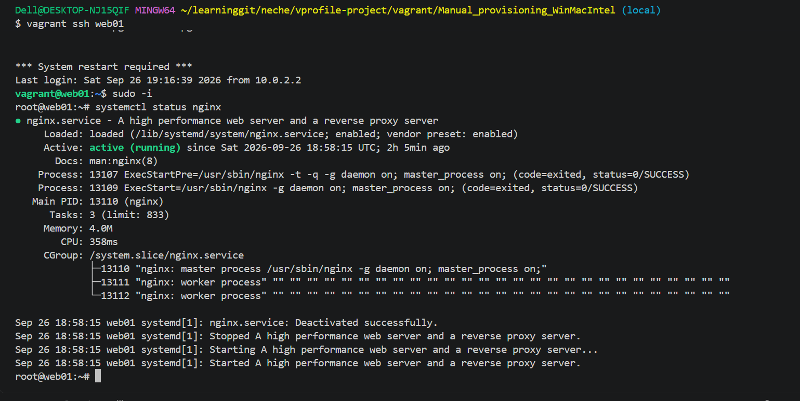
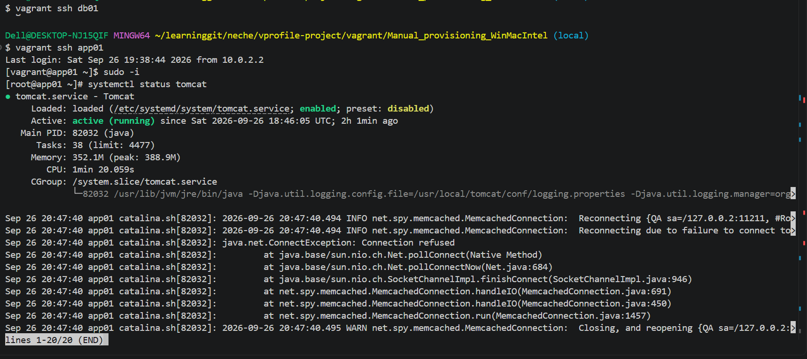
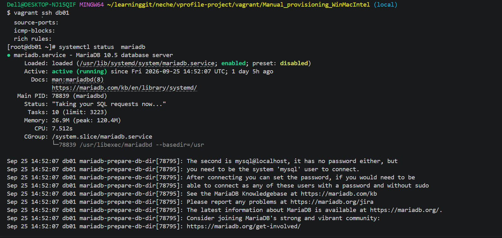
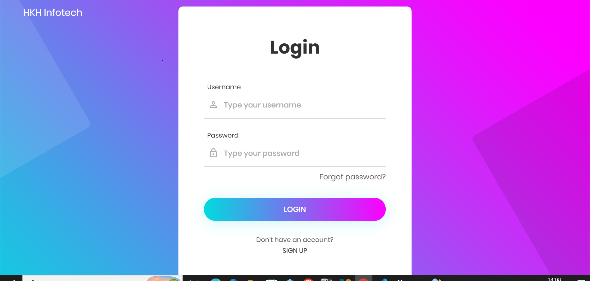
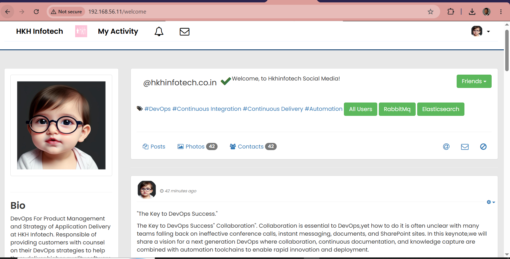
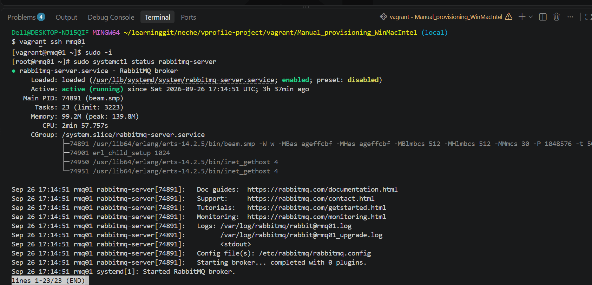

# Vprofile Multi-Tier Application Deployment

A Java Spring Boot application deployed across a 5-VM multi-tier architecture using Vagrant + VirtualBox, provisioned manually on RHEL-based Linux.

## Architecture

```
                    ┌─────────────┐
   Users ─────────▶ │   Nginx     │  (web01 - 192.168.56.11)
                    │  Reverse    │
                    │   Proxy     │
                    └──────┬──────┘
                           │ :8080
                           ▼
                    ┌─────────────┐
                    │   Tomcat    │  (app01 - 192.168.56.12)
                    │  App Server │
                    └──────┬──────┘
                           │
              ┌────────────┼────────────┐
              ▼            ▼            ▼
        ┌──────────┐ ┌──────────┐ ┌──────────┐
        │ Memcached│ │ RabbitMQ │ │  MariaDB │
        │  (mc01)  │ │ (rmq01)  │ │  (db01)  │
        └──────────┘ └──────────┘ └──────────┘
```

| VM | Role | Service | Port |
|---|---|---|---|
| web01 | Web / Reverse Proxy | Nginx | 80 |
| app01 | Application Server | Tomcat 10.1 | 8080 |
| db01 | Database | MariaDB 10.5 | 3306 |
| mc01 | DB Caching | Memcached | 11211 |
| rmq01 | Message Broker | RabbitMQ | 5672 |

## Tech Stack

- **Infrastructure:** Vagrant, VirtualBox, RHEL/CentOS-based VMs, firewalld
- **App layer:** Java 17, Apache Tomcat 10.1, Maven 3.9, Spring Boot, Hibernate/JPA
- **Data layer:** MariaDB, Memcached, RabbitMQ
- **Web layer:** Nginx (reverse proxy / load balancer)

## Deployment Order

Services were provisioned in dependency order — data/backing services first, app layer last:

1. **MySQL (MariaDB)** — database + schema seeded from `db_backup.sql`
2. **Memcached** — DB caching layer
3. **RabbitMQ** — broker/queue agent
4. **Tomcat** — built app deployed as `ROOT.war` via Maven
5. **Nginx** — reverse proxy routing to Tomcat

## Real Issues Encountered & Fixed

The setup guide gets you most of the way, but real deployments hit real problems. These were diagnosed and fixed hands-on:

### 1. Memcached failed to start — IPv6 bind error

**Symptom:** `systemctl status memcached` showed a failed state.
**Error:** `bind(): Cannot assign requested address` / `failed to listen on TCP port 11211`
**Diagnosis:** Checked `/etc/sysconfig/memcached` — `OPTIONS` was set to listen on both `127.0.0.1` and `::1` (IPv6 loopback). Confirmed via `cat /proc/sys/net/ipv6/conf/all/disable_ipv6` (returned `1`) that IPv6 was disabled system-wide, and `ip addr show` confirmed no `inet6 ::1` existed on the loopback interface.
**Fix:** Removed `::1` from the listen options (`OPTIONS="-l 127.0.0.1"`), then restarted the service.

### 2. 502 Bad Gateway on Nginx

**Symptom:** Browser showed a 502 error hitting the site.
**Diagnosis:** Checked `/var/log/nginx/error.log` first — showed `connect() failed (113: No route to host)` when Nginx tried to reach `app01:8080`. Verified basic connectivity with `ping` (succeeded) but `curl http://app01:8080` failed specifically — ping working while a specific port fails is a strong signal of a firewall block, not a network/routing issue.
**Root cause:** `firewalld` on `app01` only allowed `ssh`, `cockpit`, and `dhcpv6-client` — port 8080 was never opened.
**Fix:**
```bash
firewall-cmd --permanent --add-port=8080/tcp
firewall-cmd --reload
```

### 3. Registration/login failing with "User Not Found"

**Symptom:** The app loaded fine, but login and new-user registration both failed.
**Diagnosis:** First ruled out a data problem — queried the `accounts.user` table directly in MariaDB and confirmed seed data existed (including the default `admin_vp` account). With data ruled out, checked Tomcat's actual log file (`/usr/local/tomcat/logs/localhost.<date>.log`, not `catalina.out` — this install didn't use that filename) and found `CannotCreateTransactionException` cascading down to `java.net.NoRouteToHostException` on every request that touched the database.
**Root cause:** Same firewall pattern as Issue 2, this time on `db01` — port 3306 wasn't open.
**Fix:**
```bash
firewall-cmd --permanent --add-port=3306/tcp
firewall-cmd --reload
```

**Takeaway:** Two unrelated-looking symptoms (502 on the web tier, silent app-level failure on the data tier) traced back to the exact same root cause pattern — firewalld defaulting to a minimal allow-list on every VM. Worth checking first on any "service A can't reach service B" issue in this stack.

### 4. `wget` from archive.apache.org failing (Tomcat & Maven downloads)

**Symptom:** `wget` to `archive.apache.org` for both Tomcat and Maven returned `Connection refused`, despite DNS resolving correctly.
**Diagnosis:** Confirmed general outbound internet access was healthy (`ping 8.8.8.8` and `curl https://www.google.com` both succeeded), which isolated the problem to that specific host rather than the VM's network.
**Fix:** Switched to `dlcdn.apache.org` (Apache's current-release CDN) instead of the archive server. Since the archive mirror only serves current releases, this meant using the latest available point release (e.g., Tomcat 10.1.60 instead of the guide's 10.1.26, Maven 3.9.16 instead of 3.9.9) rather than the exact pinned version — checked available versions first with a directory listing before downloading.

## Diagnostic Approach (worth repeating)

For each issue, the pattern that worked:
1. **Read the actual error/log first** — don't guess. Nginx error log, Tomcat's `localhost.*.log`, `systemctl status` output.
2. **Isolate what's actually broken** — `ping` vs `curl` to a specific port tells you network-reachable-but-port-blocked vs. genuinely unreachable.
3. **Check firewall state explicitly** — `firewall-cmd --list-all` before assuming application-level misconfiguration.
4. **Verify data/config separately from connectivity** — e.g., confirming the database had correct seed data before assuming a data problem, which redirected the investigation toward the network layer instead.

## Screenshots

### Application working end-to-end




### Service health checks




### Known open item — Memcached client misconfiguration


Tomcat's log shows the memcached client repeatedly failing to connect:
```
INFO net.spy.memcached.MemcachedConnection: Reconnecting {QA sa=/127.0.0.2:11211...}
java.net.ConnectException: Connection refused
```
It's attempting to reach `127.0.0.2:11211` instead of `mc01`'s actual IP address. Memcached failures are non-fatal here — the app still serves requests — but caching isn't actually functioning. Likely fix: update `memcached.active.host` in `application.properties` to point to `mc01`'s real IP before the next build.

## Notes for Future Deployments

- `firewall-cmd --list-all` should be checked on every fresh VM before assuming a service issue — this stack defaults to a minimal firewall allow-list.
- Log file names/paths vary by Tomcat install method — check `find / -iname "catalina.out"` or list the `logs/` directory rather than assuming.
- Pin exact dependency versions where possible, but have a fallback plan (current-release CDN) since archive mirrors periodically prune old versions.
